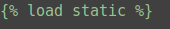

<div style="text-align: center">

</div>
<h1>Easy to use <label style="color: green;">Django</label> Manual</h1>
<h6>ko_kr .ver</h6>

<h4>대상:</h4> 

1. 웹 프레임워크 구조에 대해서 알아보고싶은 사람
2. Django에 대한 구조와 어떻게 작동하는지 알고 싶은 사람

<h4>여기서 다루지 않을 내용:</h4>

1. Python 문법에 대해서
2. Django를 설치하는법 (알려줄 수도?)
3. SQL 문법

<hr/>

<h5>참고 자료:</h5>

1. <a href="https://en.wikipedia.org/wiki/Django_(web_framework)">django_wiki</a>
2. <a href="https://docs.djangoproject.com">django official site</a>

<h1>Django EZ Manual</h1>

<h4>Django 란?:</h4>

1. Python으로 작성된 Open Source 웹 애플리케이션 프레임워크이다.
2. 장고는 MVC(모델-뷰-컨트롤러) 패턴을 따르고 있다. 하지만 컨트롤러의 기능을 프레임워크 자체에서 하기 때문에
모델, 템플릿, 뷰로 분류해 MTV 프레임워크라고 보기도 한다.
3. 장고는 데이터베이스 기반의 웹사이트를 작성하는데 있어서 수고를 더는 것이 목표이다.
4. 장고는 컴포넌트의 재사용성, 플러그인화 가능성, 빠른 개발 등을 강조하고 있다.
5. 장고는 "DRY(Don't repeat yourself: 중복배제)" 원칙을 따른다.

<hr/>

<h3>목차</h3>

0. 들어가기 전...

1. 간단한 설명 및 프로젝트 구조

2. URL 요청과 응답

3. 모델과 관리자페이지

4. 뷰와 템플릿

5. 정적 파일

6. 테스팅

7. 재사용 가능한 앱 패키징

<hr/>

<h2>0. 들어가기 전...</h2>

이제 부터 대괄호(대괄호는 왼쪽에 있는 기호가 대괄호다. [] )로 묶인 것은 자신이 마음대로 이름을 지정하거나, 혹은 자신의 설정에 맞는 값을 의미한다.  
예를 들어:  
`$ django-admin startproject [프로젝트 이름]` 을 쓰라고 하면  
자기 마음대로  
`$ django-admin startproject jinho` 라고 자기 마음대로 적을 수 있고,  
`/home/[자신의 하위 디렉토리 명]` 이면,  
자신의 기존 디렉토리 이름에 맞게 받아들여야 한다.  

마지막으로..  
무엇이 자신이 마음대로 바꿔도 되는 이름인지 자세한 설명은 하지 않을 것이다. (귀찮다..)  

<hr/>

<h2>1. 간단한 설명 및 프로젝트 구조</h2>

우선 Django가 잘 설치되어 있는지 버전을 확인해보자  
`$ python -m django --version`  

확인되었다면 이제 Django프로젝트를 만들어 보자  

<h3>하지만 그 전에!!</h3>  

<strong>
`PHP` 를 작성해본 경험이 있는 사람은 아마 코드 전체를 `/var/www/html/`과 같은  
DocumentRoot 에 두려는 경향이 있는데  
Django 에서는 되도록이면 `/var/www/html/` 과 같은 곳에 만들지 말자  
보통은 `/home/[유저]/` 과 같은 DocumentRoot 의 바깥에 두는 것을 권한다.  
외부 사람들이 웹을 통해 Python 코드를 직접 열어볼 수 있는 위험이 있기 때문이다.  
</strong>

<br>
<br>

확인 했다면 이제 만들어보자  
`$ django-admin startproject [프로젝트 이름]`  


만들었다면 무엇이 생성되었는지 확인해 보자.  

```text
[프로젝트 이름]/
    manage.py
    [프로젝트 이름]/
        __init__.py
        settings.py
        urls.py
        wsgi.py
        asgi.py
```

<h6>각각의 파일 기능과 의미는 이번 단원의 마지막에 상세하게 나온다.</h6>  

같은가??? 아마 asgi.py는 생성이 안되었을 수도 있다. (하지만 괜찮다.)  

프로젝트 디렉토리로 이동한 뒤 프로젝트를 동작해보자.  
`$ python manage.py runserver`  

자, 이제 https://127.0.0.1:8000/ 을 통해 접속해보자.  
그러면 로켓이 발사되는 모습을 볼 수 있다.  

만약, 포트를 변경하여 접속하고 싶다면: `python manage.py runserver 0:[포트번호]` 로 실행하면 된다.  

그럼 이제 프로젝트에 필요한 앱을 만들어 보자  
앱 생성: `python manage.py startapp [앱 이름]`  

만들어진 앱의 디렉토리를 보자  

```text
[앱 이름]/
    __init__.py
    admin.py
    apps.py
    migrations/
        __init__.py
    models.py
    tests.py
    views.py
    urls.py
```

<h6>각각의 파일 기능과 의미는 바로 아래 상세하게 나온다.</h2>

<hr/>

만약 이 문서의 모든 단원을 모두 읽는다면 당신은 다음과 같은 프로젝트 구조를 가지게 될 것이다.  

```text
[프로젝트 이름]/
    manage.py   # 프로젝트와 상호작용하는 커맨드라인 유틸리티
    [프로젝트 이름]/   # 프로젝트를 위한 실제 py 패키지 저장
        __init__.py   # 이 디렉토리를 패키지로 다루라고 말하는 단순한 빈 파일
        settings.py   # 프로젝트의 환경 및 구성 저장
        urls.py   # 이 프로젝트의 URL 선언 저장 (어떻게 보면 "목차 ?", "필터 ?"의 기능을 한다고 봐도 됨)
        asgi.py   # ASGI 호환 웹 서버가 프로젝트를 처리할 수 있는 진입점
        wsgi.py   # 현재 프로젝트를 서비스하기 위한 WSGI 호환 웹 서버의 진입점
    [앱 이름]/   # 앱 패키지
        __init__.py   # 이 디렉토리를 패키지로 다루라고 말하는 단순한 빈 파일
        admin.py   # 앱의 관리자 사이트에 대한 설정
        apps.py   # 앱에 대한 기본 설정 정보를 담음
        migrations/   # 데이터베이스 설정 파이를 담고 있는 디렉토리
            __init__.py   # 이 디렉토리를 패키지로 다루라고 말하는 단순한 빈 파일
            0001_initial.py   # 데이터베이스 정보를 담고있는 파일
        models.py   # 데이터 모델에 대한 정보를 정의하고 저장하는 파일, 테이블을 생성하고 테이블의 필드가 정의된 파일
        static/   # 정적 파일의 정보를 담은 파일 ex) 이미지, CSS, json 파일 등등
            [앱 이름]/   # Django가 구분하기 위해 만든 디렉토리
                images/   # 이미지 파일을 담는 디렉토리 (이미지 파일을 쓸 일이 없다면 없어도 된다.)
                    [사진].jpg   # 설명 생략
                    ...
                [css 파일이름].css   # 설명 생략
                ...
        templates/   # 프론트 작업, 페이지의 디자인이 이루어질 디렉토리
            [앱 이름]/   # Django 가 구분하기 위해 만든 디렉토리
                [html 이름1].html   # 설명 생략
                [html 이름2].html   # 설명 생략
        tests.py   # 앱을 테스트 해보기 위한 파일(QA는 중요하니깐)
        urls.py   # views 에 대한 url 설정
        views.py   # 특정 기능과 templates 를 제공하는 파일
    templates/   # 프로젝트의 템플릿 커스터마이징 디렉토리
        admin/   # Django 가 구분하기 위해 만든 디렉토리
            [...].html   # 설명 생략
```

이미 웹 프레임워크에 익숙하다면 감을 잡았을 수도 있지만 그렇지 않다면,  
아직 감이 잘 오지 않을 것이다.  
이제 본격적으로 알아보며 감을 잡아보자  

<hr/>

<h2>2. URL 요청과 응답</h2>

<h3>첫 번째 뷰 제작</h3>

`[앱 이름]/views.py` 에 들어가 다음의 코드를 입력해 보자  

```python
from django.http import HttpResponse

def main(request):
    return HttpResponse("Hello")
```

앱을 처음 제작하면 `[앱 이름]` 디렉토리 안에 `urls.py` 가 없다.  
만들도록 하자.  

이 `[앱 이름]/urls.py` 를 이용해 `views.py` 에 있는 함수(method)를 호출한다.  
그럼 이제 최상위 `[프로젝트 이름]/urls.py` 에서 `[앱 이름]/urls.py` 를 보게 설정해야 한다.  
`[프로젝트 이름]/urls.py` 에 들어가서  

```python
from django.contrib import admin
from django.urls import include, path

urlpatterns = [
    path('[앱 이름]/', include('[앱 이름].urls')),
    path('admin/', admin.site.urls),
]
```

그럼 이제 `[앱 이름]/urls.py` 가 `views.py` 를 보게 하자.  
`[앱 이름]/urls.py` 에 들어가서  

```python
from django.urls import path
from . import views

app_name = '[앱 이름]'
urlpatterns = [
    # ex: /polls/
    path('', views.main, name='main'),
]
```

<strong> 파이썬을 잘 안다면 어떤 것의 이름은 자기가 알아서 설정해도 된다는 것을 알 것이다. </strong>

<h4>path() 함수에 대한 설명</h4>

```text
path() : 2개의 필수 인수 route, view // 2개의 선택 인수 kwargs, name 총 4개의 인수가 있다.
path() : route
        일치하는 패턴을 받는다. ex) 값이 'main' 이라 하면  ==> http://127.0.0.1/main/ 에서 "/main/" 과 매치됨
path() : view
        일치하는 패턴을 찾으면 HttpRequest 객체를 첫번째 인수로 하고 경로로부터 '캡처된' 값을 키워드로 함수 호출
        ex) views.main ==> views.py 의 main 함수 호출
path() : kwargs
        임의의 키워드 인수를 view에 사전형으로 전달한다.
path() : name
        URL 에 이름을 짓는다. 이를 이용하여 템플릿을 포함한 Django 어디에나 명확하게 참조가 가능하다.
        단 하나의 파일만 수정해도 프로젝트 내의 모든 URL 패턴을 바꿀 수 있도록 도와준다. (URL Reversing을 위해)
```

<h3>요청과 응답의 과정</h3>

```text
"클라이언트" ==127.0.0.1:8000/[앱 이름]/==> "서버"
                        전달
"서버":
1. [프로젝트 이름]/urls.py
2. [앱 이름]/urls.py
3. [앱 이름]/views.py

1. --> 2. --> 3.

"서버" : 1. [프로젝트 이름]/urls.py 에서 '/[앱 이름]/' 확인 후 [앱 이름]/urls.py 호출
         2. [앱 이름]/urls.py 에서 /'' 확인 views.main 함수 호출
         3. views.main 함수 리턴 값 반환
```


<h2>3. 모델과 관리자페이지</h2>

여기서는 데이터베이스를 설치하고 첫 모델을 생성한 후,  
Django 에서 자동 생성되는 관리자 사이트에 대해 설명한다.  
자 어서 알아보도록 하자.  

<h4>하지만 그 전에!!</h4>

<strong>
Django 에서는  mysql, postgresql, sqlite3, oracle 등 다양한 DB 를 사용할 수 있다.  
이 설명에는 MySQL을 사용하여 설명할 것이다.  
지금부터 설명은, MySQL 이 설치되어 있다는 가정하에 시작한다.  
</strong>

<br>
<br>

Django 에서 `models.py` 의 역할은 데이터베이스 설정 및 관리의 역할을 한다.  
Django 와 MySQL 연동을 위해 다음의 명령어를 입력하자.  
`$ pip install mysqlclient`  

Django 프로젝트에 사용할 DATABASE를 미리 만들어야 한다.  
DATABASE를 만들도록 하자.  

이제 우리는 `[프로젝트 이름]/settings.py` 에 들어가 DATABASE = {...} 부분을 수정해야 한다.  

```python
DATABASES = {
    'default': {
        'ENGINE': 'django.db.backends.mysql',
        'NAME': '[DATABASE 이름]',
        'USER': '[DB 권한 USER 이름]',
        'PASSWORD': '[DB 권한 USER PASSWORD]',
        'HOST': '127.0.0.1',
        'POST': '3306',
        'OPTIONS': {
            'init_command':'SET sql_mode="STRICT_TRANS_TABLES"'
        }
    }
}
```

끝났다면 TIME_ZONE 을 설정하자.  
한국시 설정:  

```python
TIME_ZONE='Asia/Seoul'
USE_TZ=False
```

나중에, 클라이언트에 표시되는 시간은 한국 시간이지만 DB 에 저장되는 시간이 다르다면 자기가 스스로 왜 그런지 알아보자.  
<h6>사실 from django.utils import timezone 을 하면 된다. 이건 비밀이다.</h6>

INSTALLED_APPS 의 의미는 프로젝트내에서 사용할 앱 들을 말한다.  
우리가 만든 앱을 사용하고 싶다면 INSTALLED_APPS 에 추가하면 된다. (하지만, 그 전에 데이터베이스 설정을 먼저 끝내자)  

가끔씩, 우리는 DB 연결은 미리 하고 싶지만 TABLE 설정은 바로 안하고 싶어할 수도 있다.  

<strong>그렇다, 안하면 된다.</strong>

TABLE 설정을 하지 말고 다음의 명령어를 입력하여 보자.  
<h6>믿어도 된다.</h6>

`$python manage.py migrate`  

그렇다면, 자신이 설정한 DATABASE 에는 다음과 같은 10 개의 TABLE 들이 생겼을 것이다.  

```text
auth_group                      django_admin_log
auth_group_permissions          django_content_type
auth_permission                 django_migrations
auth_user                       django_session
auth_user_groups
auth_user_user_permissions
```

위의 TABLE 들의 의미는 뭘까?  
그렇다, INSTALLED_APPS 에 있는 기능들이 사용할 TABLE 들이 되시겠다.  

이제 어느덧 우리가 만든 앱에서 사용할 TABLE 이 필요한 순간이 왔다.  
어떻게 우리만의 TABLE 들을 Django 내에서 만들 수 있을까?  

그렇다, `[앱 이름]/models.py` 의 필드 영역을 이용하면 된다.  

지금부터는 예시와 함꼐 설명을 하겠다.  

```python
from django.db import models

# Create your models here.
class Question(models.Model):
    question_text = models.CharField(max_length=200)
    pub_date = models.DateTimeField('date published')

class Choice(models.Model):
    question = models.ForeignKey(Question, on_delete=models.CASCADE)
    choice_text = models.CharField(max_length=200)
    votes = models.IntegerField(default=0)
```

한번 이해하면 어느 순간 장고로 DB 를 설계하는 자신을 보게 될 것이다. (아마도..?)  
데이터베이스의 각 필드는 Field 클래스의 인스턴스로서 표현된다. (이게 이해하기 어렵나?)  
<strong>아주 쉽게</strong> 설명을 해보자면 현재 2 개의 클래스가 있다.  
바로 Question 과 Choice 이 클래스들의 이름은 TABLE 들의 이름이 된다.  

Question 은 `"[앱 이름]_question"`  
Choice 는 `"[앱 이름]_choice"` 로 저장된다.  

TABLE 의 이름을 설정하는 법 참 쉽다.  

클래스내에는 인스턴스가 있다.  
Question 클래스를 보면 `question_text`, `pub_date` 라는 인스턴스가 있다.  
이 둘의 인스턴스 이름은 TABLE 의 Cloumn 명으로 된다.  

column 명 설정하기 참 쉽다.  

아니 그럼 인스턴스의 속성은 무엇인가..?  
`question_text` 를 보면 `models.CharField(max_length=200)` 라고 되어있는데 이게 도대체 뭘까?  
그렇다, Column Type 이 되겠다.  

`models.CharField(max_length=200)` 은 `varchar(200)`을 의미하고,  
`models.DateTimeField('date published')` 는 `datetime` 을 나타낸다.  
당연하게도 각각의 인수값을 이용하여 Column 의 기본 값 설정 및 제한 또한 설정 가능하다.  

Column Type 설정하기 참 쉽다.  

여기서 의문, 그럼 Identity 설정 즉, Primary Key 는 왜 설정 안하는가?  
그렇다, Django 에서는 자동으로 PK 를 만들어준다. (Column 명은 id 로 되어있다.)  

참 편하다.  

Choice 클래스를 보면 `ForeignKey` 를 사용한 인스턴스가 있는데 이것은 무엇일까?  
바로, DB간 다-대-일(many-to-one), 다-대-다(many-to-many), 일-대-일(one-to-one) 과 같은 DB 관계설정을 할 수 있다.  


DB 간 관계를 설정하는 것은 중요하니 ForeignKey 메소드에 대한 설명을 하겠다.  

```text
ForeignKey([클래스 이름], [on_delete 필드])
1. CASCADE : ForeignKey 가 바라보는 값이 삭제될 때
             ForeignKey 를 포함하는 Row 도 삭제.
2. PROTECT : ForeignKey 가 바라보는 값이 삭제될 때
             ForeignKey 를 포함하는 Row 는 삭제되지 않도록 Protected Error 발생.
3. SET_NULL(null=True) : ForeignKey 가 바라보는 값이 삭제될 때
                ForeignKey 를 포함하는 Row 값을 Null 로 바꿈, (null=True 일 때).
4. SET_DEFAULT(default=[값]) : ForeignKey 가 바라보는 값이 삭제될 때
                   ForeignKey 를 포함하는 Row 값을 default 값으로 바꿈.
5. SET() : ForeignKey 가 바라보는 값이 삭제될 때
           ForeignKey SET 에 설정된 함수에 의해 Row 값 설정.
6. DO_NOTHING : ForeignKey 가 바라보는 값이 삭제될 때
                아무 일도 일어나지 않음 (참조무결성을 해칠 위험이 있다.)
```

models.py 는 데이터베이스 설정 뿐만 아니라 데이터베이스를 관리를 할 수 있는 파일이므로  
좀 더 많은 응용을 할 수 있지만 이 문서의 목적은 쉽고 빠르게 Django 에 대해 이해하는 문서이므로  
말하지 않겠다.  

우리는 각각의 입맛에 맞게 데이터베이스를 설정하였음으로 이제  
`[프로젝트 이름]/settings.py` 의 INSTALLED_APPS 에 다음과 같이  
우리가 생성한 앱도 사용하겠다고 추가하면 된다.  

```python
INSTALLED_APPS = [
    '[앱 이름].apps.[apps.py 내의 클래스 이름]'
    ...
]
```

우리가 만든 앤도 사용하겠다고 추가했으니 다음의 명령을 입력하자.  
`$ python manage.py makemigrations [앱 이름]`  

그러면 `[앱 이름]/migrations/0001_initial.py` 가 추가되었을 것이다.  
그리고 자신의 DATABASE 를 확인하여 보자.  

잘 되었는가??  

<h2>4. 뷰와 템플릿</h2>

앱의 디렉토리 내의  
`views.py` 에서 메소드는 `urls.py` 에서 주는 인자값을 받을 수 있다.  

이게 무슨 말인지 예제를 보자.  

<hr/>

`[앱 이름]/views.py`  

```python
def main(request, id):
    return HttpResponse("find %s." % id)
```

[앱 이름]/urls.py  

```python
urlpatterns = [
    ...
    path('<int:id>/', views.main, name=main)
]
```

<hr/>

어떤 과정으로 전달이 되는 것인지 알아보자.  

`http://127.0.0.1:8000/[앱 이름]/5/` 로 접속하면  
`[프로젝트 이름]/settings.py` 에서 ROOT_URLCONF 설정에 의한  
`[프로젝트 이름]/urls.py` 모듈을 보게된다. urlpatterns 를 찾고  
`[앱 이름]/` 을 찾고 따라 들어가서 `[앱 이름]/urls.py` 에 있는 urlpatterns 에 따라  
남은 `5/` 를 처리한다. urlpatterns 에서 `< int:id>/` 와 일치함으로  
`views.py` 의 main 메소드에 인자 값을 넘겨준다.  

어떤 의미인지 아직도 이해를 못한다면 지금이라도 직접 따라해보자 글만 읽는 것보다 직접 해보는 것이  
이해하는데 큰 도움을 줄 수 있다.  

<hr/>

<h3> views.py 의 기능 </h3>

우리는 views 에서 데이터베이스를 사용할 수도 있고 Python Third Party 템플릿 시스템을 사용할 수도 있다.  
`views.py` 는 PDF 를 생성하거나 XML 을 출력하거나, 실시간으로 ZIP 파일을 만들 수도 있다.  
`views.py` 는 Python 의 어떠한 라이브러리도 사용할 수 있다.  

<h4>하지만 여기서 중요한 점!</h4>

`views.py` 에 웹 코드와 디자인이 모두 하드코딩이 되어 있다면  
앱의 크기가 커질 수록 보기 매우 좋지 않고 업무를 분담하여 작업하기가 힘들 것이다...  
그래서 우리는 <strong>"분할"</strong> 을 해야한다.  
<strong>"분할"</strong> 을 위해서는 Django 의 <strong>템플릿</strong> 시스템을 이용해야 한다.  

<h3> 템플릿을 만들자 </h3>

`[앱 이름]/templates` 라는 디렉토리르 만들자.  
그리고, `[앱 이름]/templates/[앱 이름]` 디렉토리를 하나 만들자.  

그럼, "왜 templates 디렉토리안에 `[앱 이름]` 디렉토리를 왜 또 만드냐??" 라는 질문을 할 것 같은데.  
그에 대한 대답은 "구분하기 위해서" 이다.  
자세한 설명은 다음과 같다.  

```text
"Templates NameSpacing"

우리는 프로젝트를 진행할 때 하나 이상의 앱을 사용할 것이다. 
당연하게도 우리는 Django 내의 앱을 이용할 수도 다른 사람의 앱을 이용할 수도 있다.
그런데, 각각의 앱의 Templates 들을 구분하기 위해서는 그 Template 들이 
"누구"의 것인지 구분해야 할 필요가 있다.
그렇기 때문에 templates/[앱 이름] 디렉토리를 만드는 것이다.

그런데, 여기서 "templates 의 상위 디렉토리 이름을 보고 구분하면 되는것 아님?" 라고 궁금증이 생길 수도 있다.
하지만, 나는 Django 프레임워크를 만든 사람이 아니기 때문에 대답하지 않겠다.
나의 개인적인 생각이지만 아마 Templates 의 상위 디렉토리는 보지 않기 때문에 그런것 같다. (당연한 얘기인가?)
```

이제 우리는 Django 의 템플릿 시스템을 이용하기 위한 준비가 되었다.  
`[앱 이름]/templates/[앱 이름]` 디렉토리에 `main.html` 을 만들어보자 (물론 굳이 main.html 이 아니어도 좋다.)  

우리는 템플릿에 웹 코드를 작성할 것임으로 `[앱 이름]/views.py` 를 수정하여야 한다.  

```python
from django.template import loader
from django.http import HttpResponse

def main(request):
    template = loader.get_template('[앱 이름]/main.html')
    return HttpResponse(template.render(request))
```

간단하지 않은가? 하지만 Django 에서는 더 간단하게 만들 수도 있다.  

Django 에서 지원하는 `render()` 함수를 사용하여 보자.  

```python
from django.shortcuts import render

def main(request):
    return render(request, '[앱 이름]/main.html')
```

더 간결해진 것을 확인할 수 있다.  

<h4>render() 에 대해서...</h4>

```text
render() 는 1 번 인수로 request 객체를 받고 2 번 인수로는 템플릿의 이름을 받는다. 
3 번 인수는 "옵션"인데 context 사전형 객체를 선택적으로 받는다.

render() 는 템플릿의 HttpResponse 객체를 반환해준다.
```

<hr/>

<h4>404 에러 발생하기</h4>

만약 데이터베이스에서 데이터를 불러오지 못할 때  
간단하게 404 에러를 발생하여 보자.  

Ex)  
만약 `models.py` 에서 설정한 Question 필드의 데이터를 불러오려 한다고 가정하자.  
당연하게도 `models.py` 의 Question 을 import를 해야한다.  

```python
...
from .models import Question

def main(request, question_id):
    question = get_object_or_404(Question, pk=question_id)
    return render(request, '[앱 이름]/main.html', {'question': question})
``` 

위 코드를 분석해 보면 `question_id` 값이 Question 필드 데이터베이스에 존재하지 않으면  
404 에러를 발생시키고, 존재하면 그 값을 context에 담아 `HttpResponse` 객체를 반환하는 것을 알 수 있다.  

<hr/>

<h2>5. 정적 파일</h2>

프로젝트를 진행하다 보면 정적 데이터를 사용해야 할 때가 온다.  
Django 에서는 그 정적 파일을 static 디렉토리에서 관리한다.  
static 에는 CSS 와 같은 stylesheet, 이미지 정보, JS 등을 넣을 수 있다.  
이로써 우리는 웹을 좀 더 풍부하게 만들 수 있다.  
다음과 같이 만들어보자.  

`[앱 이름]/static` 디렉토리를 만들고  
`[앱 이름]/static/[앱 이름]` 디렉토리를 만들자. (templates 와 구성이 비슷하다!)  


`[앱 이름]/static/[앱 이름]/style.css` 를 만들고 실제 적용을 해보자.  
우리는 `[앱 이름]/templates/[앱 이름]/main.html` 파일의 맨 윗 줄에  
다음과 같이 한 줄만 추가하면 된다.  

  

static 폴더의 파일들을 모두 쓸 수 있다.  
다른 파일들은 "알아서" 응용하자.  

<hr/>

<h2>6. 테스팅</h2>

<h4>테스트를 만들어야 하는 이유</h4>

"아니 힘들게 왜 만들어야 하는거지?" 라고 생각할 수도 있고,  
"굳이 지금?" 이라고 생각할 수도 있다.  
자동화된 테스트를 만드는 것이 이 프로젝트와 앱을 작동하게 하는 것도 아니지만  
더 많은 것을 하기 위해서는 자동화된 테스트를 작성하는 것이 좋다.  
점점 더 정교한 어플리케이션을 만들어가면 수많은 복잡한 상호작용이 있을 것이다.  
수동적으로 일일이 다 테스트를 하는 것보다 몇초만에 테스트를 끝낼 수 있다면 귀한 시간을 아낄 것이다.  
또한, 테스트를 통해 예기치 않은 동작을 일으키는 코드를 식별하는데 큰 도움을 얻을 수 있다.  

테스트는 문제를 식별하는 것이 아닌 예방이라고 볼 수 있다.  
테스트가 없으면 어플리케이션의 목적 또는 의도된 동작이 불투명 할 수 있고,  
심지어 자신의 코드임에도 불구하고 정확히 무엇을 하고 있는지 알아내려고 노력을 할 수도 있다.  

테스트는 팀이 함께 일하는것에 큰 도움을 준다.  
테스트는 동료가 실수로 코드를 손상시키지 않는다는 것을 보증해 줄 수 있다.  

tests.py 에서 어떻게 테스트케이스를 짜야하는지에 대해서는 설명하지 않겠다.  
하지만 테스트케이스를 짰다면 다음의 명령어로 테스팅을 할 수 있다.  

`$ python manage.py test [앱 이름]`  

<hr/>

<h2>7. 재사용 가능한 앱 패키징</h2>

<h4>앱 패키징 하기</h4>

1. 먼저 Django 프로젝트 디렉토리 외부에 앱을 담을 디렉토리를 만드는데 이때 이름은  
`"django-[앱 이름]"` 으로 설정하는 것을 권장한다.  

2. `django-[앱 이름]` 디렉토리로 앱을 옮긴다.  

3. `django-[앱 이름]` 에 `README.rst` 파일을 만든다.   
여기서 README.rst 파일은 앱의 "표지", 어떻게 사용하는지 알려주는 "목차" 역할을 한다.  

4. `django-[앱 이름]` 에 `LICENSE` 파일을 만든다.  
대부분 Django 호환 앱은 BSD 라이센스로 배포된다.  

5. `django-[앱 이름]` 에 `setup.cfg` 와 `setup.py` 를 만든다.  

<hr/>

`setup.cfg` 예시  

```buildoutcfg
[metadata]
name = django-[앱 이름]
version = 0.1
description = [설명]
long_description = file: README.rst
url = https://www.example.com/
author = jinho
author_email = example@gmail.com
license = BSD-3-Clause # Example license
classifiers =
    Environment :: Web Environment
    Framework :: Django
    Framework :: Django :: X.Y # Replace "X.Y" as appropriate
    Intended Audience :: Developers
    License :: OSI Approved :: BSD License
    Operating System :: OS Independent
    Programing Language :: Python
    Programing Language :: Python :: 3
    Programing Language :: Python :: 3 :: Only
    Programing Language :: Python :: 3.6
    Programing Language :: Python :: 3.7
    Programing Language :: Python :: 3.8
    Topic :: Internet :: WWW/HTTP
    Topic :: Internet :: WWW/HTTP :: Dynamic Content

[options]
include_package_data = true
packages = find:
```

<hr/>

`setup.py` 예시 (간단하다.)  

```python
from setuptools import setup

setup()
```

<hr/>

`django-[앱 이름]` 에 `MANIFEST.in` 파일을 만든다.  
지금까지 우리는 파이썬 모듈과 패키지만 포함했는데 추가 파일을 포함시키기 위해서는  
`MANIFEST.in` 파일에 작성하여 포함시켜야 한다.  

`MANIFEST.in` 예시  

```text
include LICENSE
include README.rst
recursive-include polls/static *
recursive-include polls/templates *
recursive-include docs *
```

<hr/>

선택 사항이지만 자세한 설명을 하는 문서를 추가 시키는 것을 추천한다.  
`django-[앱 이름]` 에 docs 라는 빈 디렉토리를 생성하고 `MANIFEST.in` 에 다음 한 줄을 추가한다.  
`recursive-include docs *`  

<hr/>

`$ python setup.py sdist` 를 입력하여 패키지를 빌드한다.  

`"django-[앱 이름]-0.1.tar.gz"` 라는 파일이 생성되면  
패키지 만들기에 성공한 것이다.  

우리가 만든 패키지를 다시 설치해보자 프로젝트 파일에서 다음의 명령어를 입력한다.  
`$ python -m pip install --user django-[앱 이름]/dist/django-[앱 이름]-0.1.tar.gz`  

프로젝트를 다시 실행시켜보면 정상적으로 작동한다.  

패키지 삭제는 다음의 명령어를 입력한다.  
`$ python -m pip uninstall django-[앱 이름]`  

<hr/>

<h3>여기까지...</h3>

지금까지 우리는 어플리케이션을 어떻게 구조적으로 만드는지부터 패키지를 제작하는 단계까지 알아보았다.  
아직, Django 내부 템플릿이나 내부 기능들에 대해 설명을 하지 않았지만 그래도 Django 를 어떻게 써야 하는지  
감을 잡는데 도움되었으면 한다.  
부족한 내용이 있다면 수정도 하고 추가적인 내용도 덧붙일 계획이 있으니  
개선할 내용 및 알고싶은 내용이 있다면 `max000807@gmail.com` 으로 메일을 보내도 좋다.  
